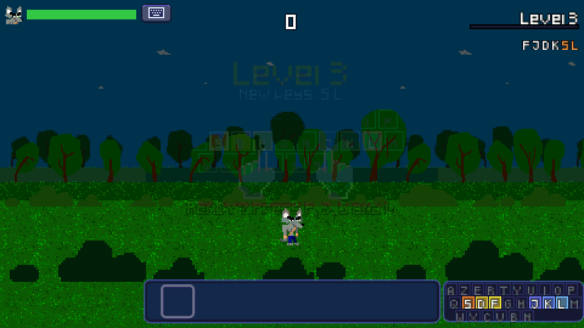
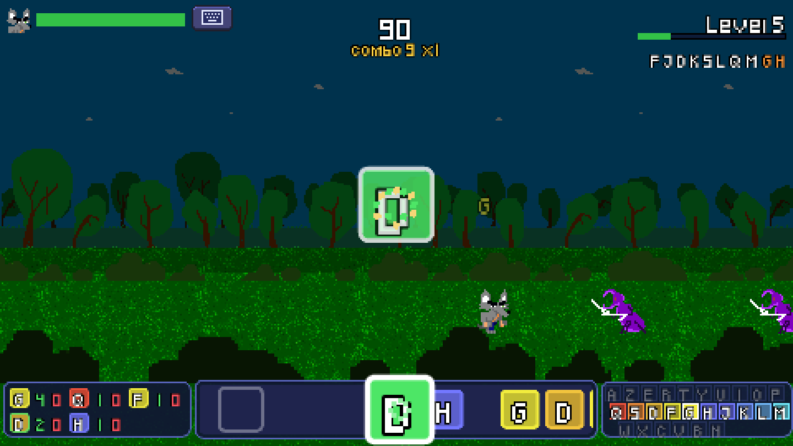
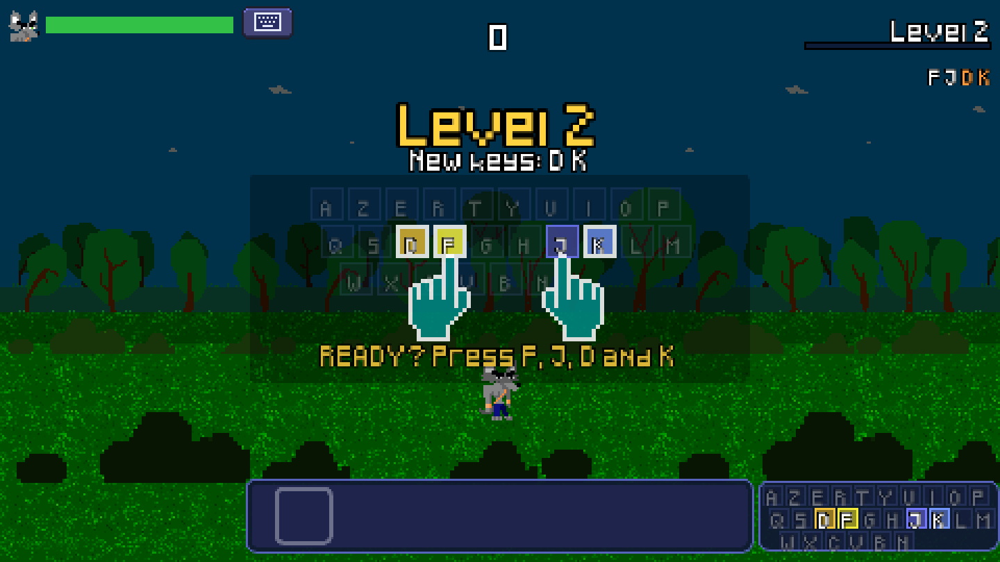
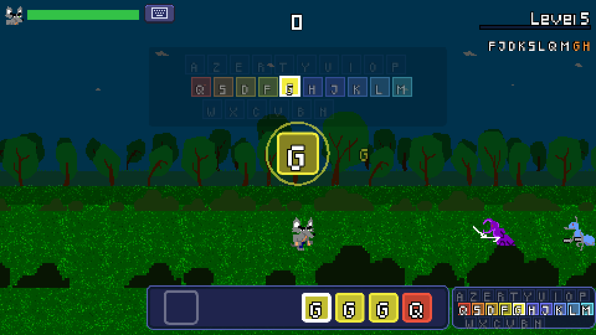

<div align="center">


# ⌨️ Type to Fight

**An arcade game to learn touch typing: type the right key to strike the enemies.**

Free · All ages · Linux x86_64 · Browser · Made with Godot 4.7

[](https://flathub.org/apps/org.dupot.typetofight)
[](https://snapcraft.io/dupot-type-to-fight)
[](https://godotengine.org)
[](LICENSE)

<a href="https://flathub.org/apps/org.dupot.typetofight"></a>
<a href="https://snapcraft.io/dupot-type-to-fight"></a>



</div>

---

## 📖 About

Enemies keep coming from the right. The next key to type **falls in the center of the screen**: type it to strike the enemy, or rush towards it if it is still far away. Miss too often and they will reach you!

- 🎯 **Progressive lessons**: start with the **F** and **J** home keys, then D K, S L, Q M, G H, the top row and the bottom row, in **AZERTY** or **QWERTY**
- 🖐️ **One color per finger**: warm colors for the left hand, complementary colors for the right hand, darker on the top row and lighter on the bottom row
- 🥁 **Rhythm-game feel**: the key falls in the center with an approach ring, the next keys slide along the lane at the bottom of the screen
- ✅ **Get ready**: each level starts by placing your index fingers on F and J and finding the new keys
- ❌ **Learn from mistakes**: a keyboard shows the wrong key and the expected one, and your weak keys come back more often until you master them
- 📊 **Earn your progress**: 94% accuracy is needed to unlock the next level, with live per-key stats and a recap at the end of each level
- 🏃 **Runner style**: the camera follows the player through an endless parallax forest
- 🌍 Available in **English** and **French**

## 📸 Screenshots

<div align="center">

| Type the falling key | Get ready: index fingers on F and J | The key to type, colored by finger |
|:---:|:---:|:---:|
|  |  |  |
| **Wrong key? The keyboard shows you** | **Level results** | **Main menu** |
|  |  |  |

</div>

## 🎮 Controls

| Action | Keyboard |
|---|---|
| Strike an enemy | Type the key shown in the center |
| Start a level | Press F, J and the new keys of the level |
| Show / hide the small keyboard | `Tab` (or the keyboard button at the top) |
| Continue after the level results | `Space` or `Enter` |
| Pause | `Esc` |

The keyboard layout (AZERTY / QWERTY), the difficulty and the language are chosen in the main menu.

## 📦 Install

### Flathub (Linux, recommended)

```bash
flatpak install flathub org.dupot.typetofight
flatpak run org.dupot.typetofight
```

You can also install it from GNOME Software, KDE Discover or any app store that uses Flathub.

### Snap Store (Linux)

```bash
sudo snap install dupot-type-to-fight
```

### Browser (HTML5)

The game also runs in a web browser: see `export_html5.sh` below to build it.

## 🛠️ Build from source

1. Install [Godot 4.7](https://godotengine.org/download).
2. Clone the repository:
   ```bash
   git clone https://github.com/imikado/dupotTypeToFight.git
   ```
3. Open `project.godot` in Godot and press **F5** to play.

Export presets for **Linux** and **HTML5** are included in `export_presets.cfg`, with helper scripts (they use `godot` from your `PATH`, or the `GODOT` environment variable):

| Script | Result |
|---|---|
| `./export_html5.sh` | HTML5 export in `export/HTML5/` and `dupotTypeToFight-html5.zip` (for itch.io) |
| `./bundle.sh` | `export/Linux/bundle.tar.gz` for the Flathub manifest (pck, icons, appdata, .desktop) |
| `./export/Linux/snap/update-version.sh` | syncs the snap version with `config/version` in `project.godot` |
| `./export/Linux/snap/build-snap.sh` | exports the Linux build and packs the snap |

## 🌍 Translations

Texts live in `src/Locales/translations.csv` (one column per language). To add a language: add a column to the CSV, register its generated `.translation` file in `project.godot` (Internationalization), add its code to `GlobalGame.LANGUAGES` and an entry in the menu. Note that the Pixeled font does not include every accented letter (no ê, à, â, î, ô, û…).

## 🗂️ Project structure

- `src/Autoload`: global state (game, player, lessons and finger colors, events, transition)
- `src/Actors`: player and enemies (ant, spider, beetle)
- `src/Levels`: main level and parallax background
- `src/UI`: HUD, key lane, center key, keyboards, level results, screens (boot, menu, game over)
- `src/Locales`: translations
- `export/Linux`: Flathub and Snap packaging files, store screenshots

Sprites and font come from Beat And Match To Pass.

## 🕹️ More from dupot.org

Also from the same developer:

- **Save the Sheep**
- **Beat And Match To Pass**
- **Little Adventure**
- **Easyflatpak**

See them all on [dupot.org](https://www.dupot.org/games.html).

## 🐛 Feedback

Found a bug or have an idea? [Open an issue](https://github.com/imikado/dupotTypeToFight/issues).

## 📜 License

This game is released under the [GNU LGPL v2.1](LICENSE).

---

<div align="center">

Made with ❤️ and [Godot Engine](https://godotengine.org) by [Michael Bertocchi](https://www.dupot.org/games.html) · [dupot.org](https://www.dupot.org)

</div>
