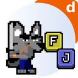
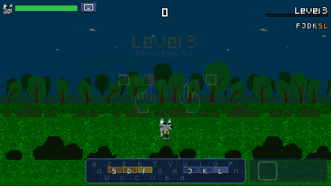
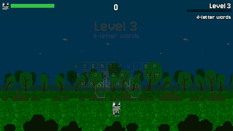
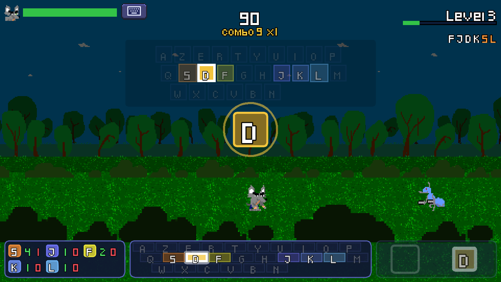
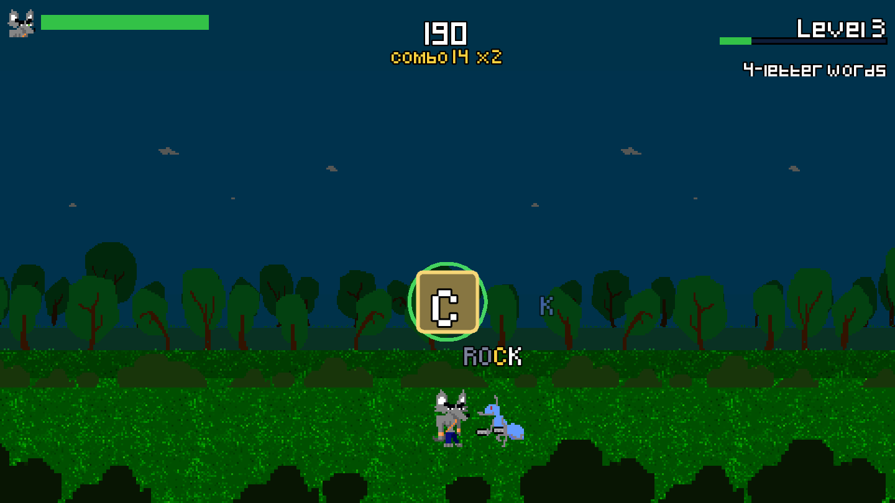
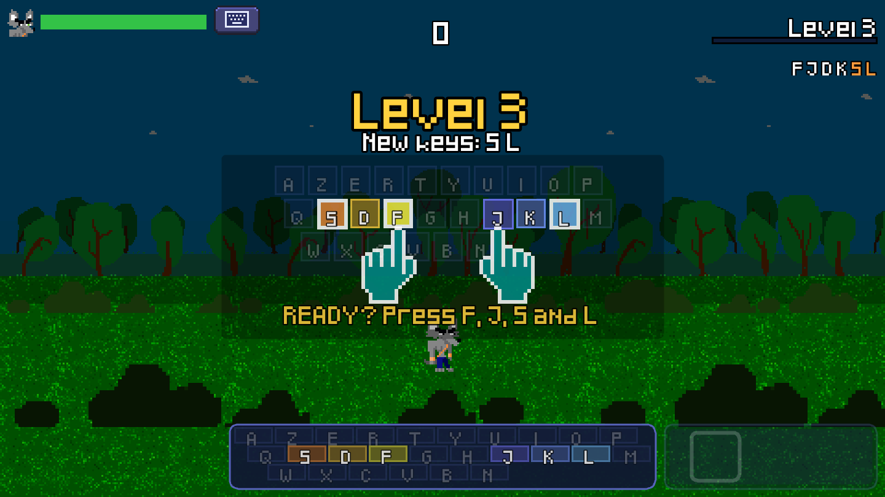
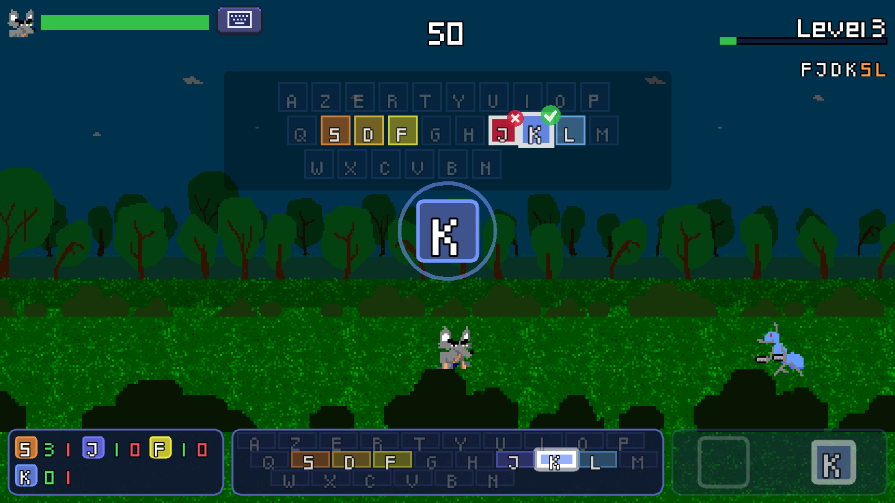
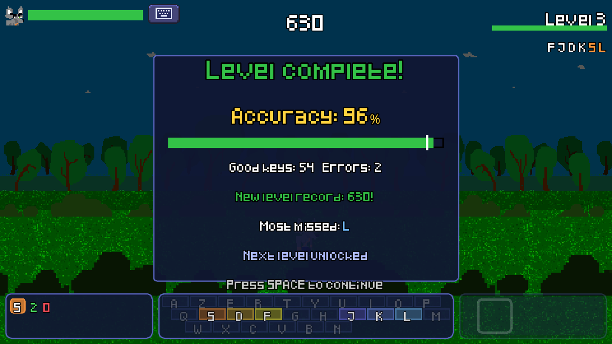
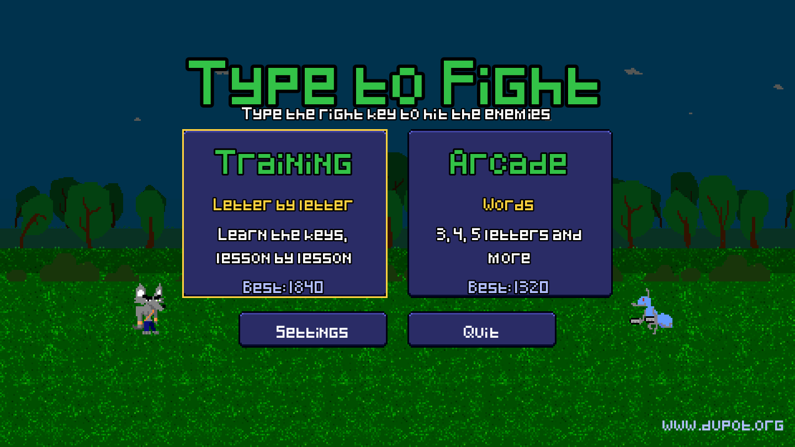
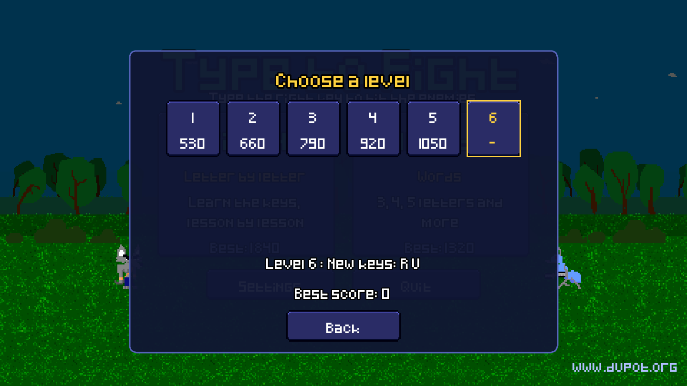

<div align="center">



# ⌨️ Type to Fight

**An arcade game to learn touch typing: learn the keys letter by letter in Training, then type whole words in Arcade to strike the enemies.**

Free · All ages · Play in your browser · Made with Godot 4.7

[](https://dupot-org.itch.io/type-to-fight)
[](https://godotengine.org)
[](LICENSE)

**▶️ [Play now on itch.io](https://dupot-org.itch.io/type-to-fight)**

| 🎓 Training: learn the keys letter by letter | 🕹️ Arcade: type whole words |
|:---:|:---:|
|  |  |

</div>

---

## 📖 About

Enemies keep coming from the right: type the right keys to strike them, or rush towards them if they are still far away. Miss too often and they will reach you!

## 🎮 Two game modes

Choose your mode right from the main menu. Each mode has its own levels, progress and best scores.

### 🎓 Training: learn the keys, letter by letter

The touch typing course. Each enemy carries one key at a time, and the key to type **falls in the center of the screen**.

- 🎯 **Progressive lessons**: start with the **F** and **J** home keys, then D K, S L, Q M, G H, the top row and the bottom row, in **AZERTY** or **QWERTY** (13 lessons, then all keys, faster)
- 🎓 **Tutorial before level 1**: where to put your hands, the small bumps on F and J, one finger per color, shown with zoomed keys and pixel art hands (with a Skip button, and it can be turned off in the settings)
- ✅ **Get ready**: each level starts by placing your index fingers on F and J and finding the new keys
- ⌨️ **Help keyboard**: during the lessons, a see-through keyboard stays in the center of the screen with the key to type highlighted
- 🥁 **Rhythm-game feel**: the key falls in the center with an approach ring, the next keys slide along the lane at the bottom of the screen
- 📊 **Bottom panel**: live per-key stats, a small keyboard (`Tab`) and the lane of the next keys
- 🐜 **More keys per enemy over time**: ants (1 key) at first, then spiders (2 keys) from level 3 and beetles (3 keys) from level 5

### 🕹️ Arcade: type whole words

Once you know the keys, put them together. Each enemy carries a **word written above it**: the next letter is shown in yellow, the typed ones fade out.

- 📏 **Longer and longer words**: 3 letters at levels 1 and 2, then 4, 5, 6, and up to 7 letters from level 9
- 🌍 **Words in your language**: English or French, following the language of the game
- 🧹 **Lighter screen**: no bottom panel, the whole scene moves down to give more room to the action
- 🐢 **Fair pace**: fewer enemies per level, a bit slower and more spaced out when the words get longer

## ✨ In both modes

- 🖐️ **One color per finger**: warm colors for the left hand, complementary colors for the right hand, darker on the top row and lighter on the bottom row
- ❌ **Learn from mistakes**: a keyboard shows the wrong key and the expected one, and your weak keys come back more often until you master them (in Arcade, through the words that contain them)
- 📊 **Earn your progress**: 94% accuracy is needed to unlock the next level (or 90%, 80%, 70% in the settings), with a recap at the end of each level
- 🔁 **Never start over**: after a game over, retry the same level as many times as you like, your weak keys are kept
- 🗺️ **Pick your level**: every level you reached stays unlocked and can be replayed from the menu
- 🏆 **Best scores saved**: a record for each level, plus your best games, for each game mode
- ⚔️ **Fair damage**: ants hit for 10, spiders for 12 and beetles for 14, whatever the level
- 🏃 **Runner style**: the camera follows the player through an endless parallax forest
- 🌍 Available in **English** and **French**

## 📸 Screenshots

<div align="center">

| Training: type the falling key | Arcade: type the words | Get ready: index fingers on F and J |
|:---:|:---:|:---:|
|  |  |  |
| **Wrong key? The keyboard shows you** | **Level results** | **Main menu: two game modes** |
|  |  |  |
| **Replay any level you reached** | | |
|  | | |

</div>

## 🎛️ Controls

| Action | Keyboard |
|---|---|
| Choose a game mode | Click **Training** or **Arcade** in the main menu (or arrow keys and `Enter`) |
| Strike an enemy | Training: type the key shown in the center · Arcade: type the next letter of the word |
| Start a level | Training: press F, J and the new keys of the level · Arcade: press F and J |
| Show / hide the small keyboard (Training) | `Tab` (or the keyboard button at the top) |
| Continue after the level results | `Space` or `Enter` |
| Pause | `Esc` |
| Tutorial: next page / skip | `Space` or `Enter` / `Esc` |

The **Settings** of the main menu let you choose the difficulty, the keyboard layout (AZERTY / QWERTY), the language, the accuracy needed to pass a level (94%, 90%, 80% or 70%) and whether the tutorial is shown before level 1 of Training.

## 📦 Play

### itch.io (browser)

Play it in your browser, no install needed: **[dupot-org.itch.io/type-to-fight](https://dupot-org.itch.io/type-to-fight)**

### Flathub and Snap Store (Linux): coming soon

Linux packages are being prepared (`org.dupot.typetofight` on Flathub, `dupot-type-to-fight` on the Snap Store). The packaging files and the icon are ready in `export/Linux`; they will be published soon.

## 🛠️ Build from source

1. Install [Godot 4.7](https://godotengine.org/download).
2. Clone the repository:
   ```bash
   git clone https://github.com/imikado/dupotTypeToFight.git
   ```
3. Open `project.godot` in Godot and press **F5** to play.

Export presets for **Linux** and **HTML5** are included in `export_presets.cfg`, with helper scripts (they use `godot` from your `PATH`, or the `GODOT` environment variable):

| Script | Result |
|---|---|
| `./export_html5.sh` | HTML5 export in `export/HTML5/` and `dupotTypeToFight-html5.zip` (the build uploaded to itch.io) |
| `./bundle.sh` | `export/Linux/bundle.tar.gz` for the Flathub manifest (pck, icons, appdata, .desktop) |
| `./export/Linux/snap/update-version.sh` | syncs the snap version with `config/version` in `project.godot` |
| `./export/Linux/snap/build-snap.sh` | exports the Linux build and packs the snap |
| `python3 tools/generate_icon.py` | regenerates the game icon in the dupot.org style (Flathub sizes, `icon.png`, snap icon) from the player sprite; needs Pillow |
| `python3 tools/generate_itch_cover.py` | regenerates the itch.io cover image (630x500) in `export/itch/cover.png` from the game assets; needs Pillow |
| `python3 tools/generate_tutorial_hands.py` | regenerates the pixel art hands of the tutorial (`src/UI/Hands/hand-left.png`, `hand-right.png`); needs Pillow |
| `tools/capture_media.sh` | regenerates the demo GIFs (`docs/training.gif`, `docs/arcade.gif`) and the screenshots (`export/Linux/screenshots`): a bot plays the game; needs Godot 4.7 and ffmpeg, opens game windows for a few minutes and keeps your saved progress |

## 🌍 Translations

Texts live in `src/Locales/translations.csv` (one column per language). To add a language: add a column to the CSV, register its generated `.translation` file in `project.godot` (Internationalization), add its code to `GlobalGame.LANGUAGES` and an entry in the menu. Note that the Pixeled font does not include every accented letter (no ê, à, â, î, ô, û…).

## 🗂️ Project structure

- `src/Autoload`: global state (game modes and saved progress, player, Training lessons and finger colors, Arcade word lists, events, transition)
- `src/Actors`: player and enemies (ant, spider, beetle)
- `src/Levels`: main level and parallax background
- `src/UI`: HUD, key lane, center key, keyboards, level results, tutorial, screens (boot, menu with the two game modes, level choice and settings, tutorial, game over)
- `src/Locales`: translations
- `tools`: Python scripts generating the icon, the itch.io cover and the tutorial hands, and the capture script for the GIFs and screenshots
- `docs`: gameplay GIFs of the two game modes
- `export/Linux`: Flathub and Snap packaging files, store screenshots
- `export/itch`: itch.io cover image

Sprites and font come from Beat And Match To Pass.

## 🕹️ More from dupot.org

Also from the same developer:

- **Save the Sheep**
- **Beat And Match To Pass**
- **Little Adventure**
- **Easyflatpak**

See them all on [dupot.org](https://www.dupot.org/games.html).

## 🐛 Feedback

Found a bug or have an idea? [Open an issue](https://github.com/imikado/dupotTypeToFight/issues).

## 📜 License

This game is released under the [GNU LGPL v2.1](LICENSE).

---

<div align="center">

Made with ❤️ and [Godot Engine](https://godotengine.org) by [Michael Bertocchi](https://www.dupot.org/games.html) · [dupot.org](https://www.dupot.org)

</div>
